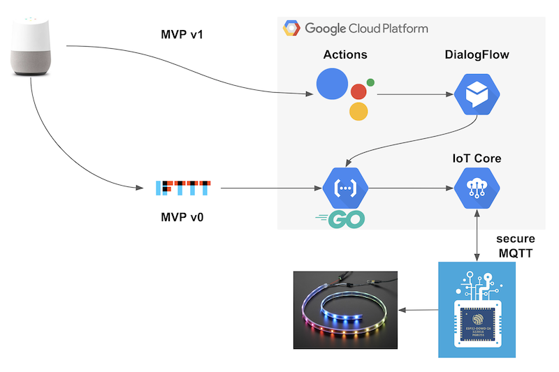
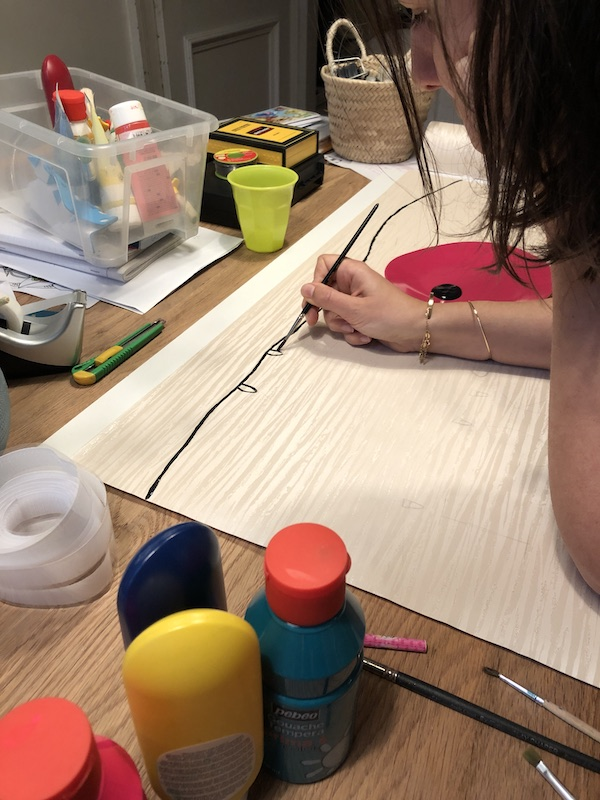
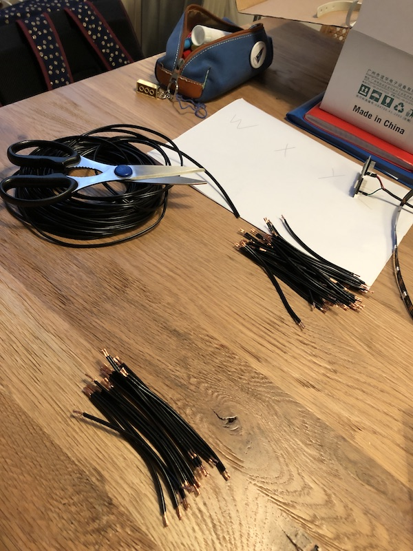
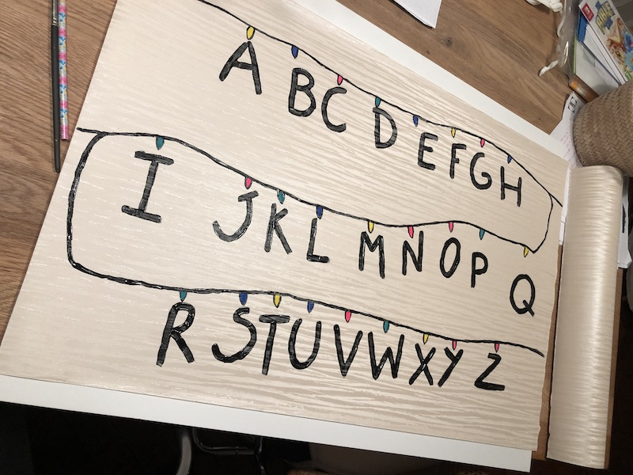
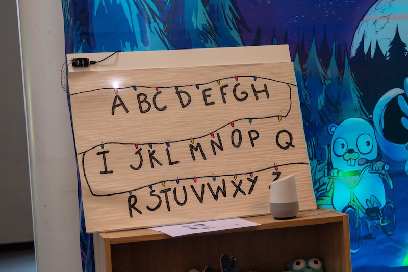

# Tuto DIY : construisez votre guirlande connectée Stranger Things

Dans le cadre du [DevFest Lille 2019](https://devfest.gdglille.org), l'équipe Lilloise de [SFEIR](https://www.sfeir.com)
s'est fixée pour objectif de construire sa propre guirlande connectée pour parler avec [le monde à l'envers](https://strangerthings.fandom.com/fr/wiki/Monde_%C3%A0_l%27envers).

## Itération 0

Première étape cadrer le sujet : _Permettre d'énoncer des mots à une Google Home et voir la guirlande les épeler._

### Liste du matériel

 * Un microcontrôleur Arduino [ESP8266](https://www.amazon.fr/gp/product/B06Y1ZPNMS)
 * Une [alimentation micro USB](https://www.amazon.fr/gp/product/B00U88KSHO)
 * Une [guirlande de LED NeoPixel Adafruit](https://www.amazon.fr/gp/product/B00XQN3AF0)
 * Du [fil d'électronique](https://www.amazon.fr/gp/product/B07G744V5Z), de l'étain et un fer à souder
 * Du [carton plume](https://www.rougier-ple.fr/carton-plume-3mm-classique.r.html) pour le support
 * Une tapisserie bien kitch
 * De la peinture
 * De l'huile de coude et de la patience

### Architecture

Fort de notre expérience [Google Cloud Platform](https://console.cloud.google.com) chez SFEIR, il était impensable d'utiliser un autre produit pour notre backend.
Le backend de notre projet s'articulait autour des composants et contraintes suivantes :

 * [Go](https://golang.org) for the Win
 * Une [Cloud Function](https://cloud.google.com/functions/docs/quickstart-go) pour la mise à jour Over The Air (OTA) de notre microcontrôleur
 * Une [Cloud Function](https://cloud.google.com/functions/docs/quickstart-go) de réception de l'énoncé en provenance de la Google Home et qui actionne la guirlande
 * Un bus [IoT Core](https://cloud.google.com/iot-core/?hl=fr) pour l'enregistrement,la sécurisation et la communication avec les devices IoT, ici notre ESP8266
 * Le firmware à proprement parler de notre microcontrôleur
 
 Le schéma suivant présente l'assemblage de toutes ces briques logicielles :
 

### Fonctionnement

 1. La Google Home est interfacée avec [IFTTT](https://ifttt.com) pour répondre à une phrase bien précise : "Ok Google, affiche Bonjour Lille"
 2. Le paramètre "Bonjour Lille" est récupéré par IFTTT et transmis via HTTP à la Cloud Fonction de la guirlande
 3. Le paramètre "Bonjour Lille" après nettoyage et validation est envoyé au firmware de l'ESP via [MQTT](http://mqtt.org) pour affichage 
 4. Les mots sont décomposés et affichés sur les LED successivement
 
## Firmware

Au niveau du microcontrôleur ESP8266, nous avons utilisé les librairies suivantes :

 * [Google Cloud IoT Arduino](https://github.com/GoogleCloudPlatform/google-cloud-iot-arduino), pas officiellement supportée par Google, mais permet de faciliter la gestion de la communication entre le microcontrôleur et GCP
 * [Adafruit NeoPixel](https://github.com/adafruit/Adafruit_NeoPixel) pour pouvoir piloter les différentes LED de notre guirlande.

Et quelques librairies utilitaires :

 * [WifiManager](https://github.com/tzapu/WiFiManager) permet de gérer facilement la connexion à un nouveau réseau wifi avec la mise en place d'un mode point d'accès avec portail captif
 * [ArduinoJson](https://github.com/bblanchon/ArduinoJson) pour la gestion du format JSON

D'abord, différentes étapes utilitaires requises à l'initialisation du microcontrôleur sont effectuées :

 1. Connexion au dernier réseau wifi enregistré, s'il n'est pas accessible, passage en mode point d'accès pour permettre l'enregistrement d'un nouveau réseau wifi
 2. Après connexion au réseau wifi, génération d'un token JWT, et authentification auprès de GCP
 3. Inscription aux deux topics MQTT hébergés sur GCP (un pour la configuration, le second pour les messages)

Une fois ces étapes réalisées, nous entrons dans la boucle de fonction du microcontrôleur qui fera les actions suivantes :

 * S'il n'y a pas eu de messages à traiter depuis 15 min, passage en mode "veille", avec affichage de lettres aléatoires (une toute les deux secondes)
 * Si un nouveau message arrive sur le topic MQTT des messages, découpage du mot, et pour chacune des lettres affichage de la LED correspondante
 * Si un nouveau message arrive sur le topic MQTT de configuration, mise à jour de la configuration et/ou mise à jour du firmware via la Cloud Fonction dédiée
 
Pour afficher une lettre sur la guirlande, les actions suivantes doivent être réalisées :

 1. Configuration du l'état à afficher (position et couleur du pixel à allumer)
 2. Envoi de la configuration à la guirlande
 3. Attente de X millisecondes
 4. Nettoyage de l'état de la guirlande (tous les pixels éteints)
 5. Envoi de la configuration à la guirlande

## Réalisation

Concernant la réalisation à proprement parler, voici les étapes réalisées :

1. Dessiner la guirlande au crayon pour définir la position régulière des ampoules sur le papier peint 
2. Découpe des fils à la bonne taille pour souder les LED de la guirlande 
3. Découper unitairement les LED de la guirlande en gardant leur bon ordre
4. Souder les LED avec les fils, penser à étamer les fils avant pour plus de facilité
5. Peindre la guirlande sur le papier peint 🖌 
5. Perforer le papier peint pour faire apparaitre les LED
6. Fixer les LED au dos du papier peint
7. Fixer le papier peint, la guirlande et l'Arduino sur un support en papier plume pour un rendu solide
(nous avons utilisé du scratch adhésif pour l'Arduino) 

## Ressources

 * [Inspiration pour le firmware Arduino et la réalisation](https://spin.atomicobject.com/2017/12/21/diy-stranger-things-alphabet-wall)
 * Code source du projet disponible sur le [compte GitHub OSPO de SFEIR](https://github.com/sfeir-open-source/sfeir-cloud-iot)
 
## Améliorations possibles 

 * Amélioration de l'identification et sécurisation de l'OTA
 * Migration du firmware de l'ESP vers Go grâce au projet [Gobot](https://gobot.io)
 * Protection de l'ESP par un [boitier imprimé en 3D](https://www.thingiverse.com/search?q=nodeMCU&dwh=635d08c93275164)
 
## Remerciement 
 * Merci à [Antoine](https://twitter.com/denouche) ❤️ pour le [firmware et le tooling](https://github.com/denouche/arduino-tassimo) issus de sa cafetière connectée.
 * Merci à [Aurélien](https://twitter.com/sn0rks) pour la relecture 🤓

## Résultat final
